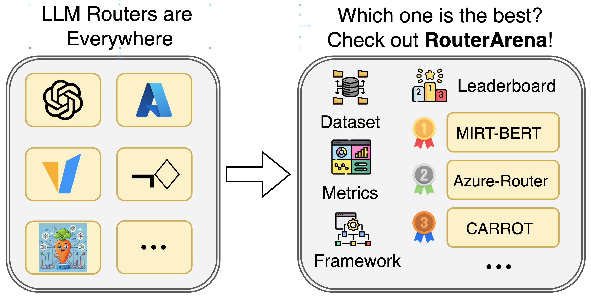

<div align="center">
  

  <br>
  <p>
    <!-- <a href="https://www.python.org/"></a> -->
    <a href="https://www.notion.so/Who-Routes-LLM-Routers-28d52ffb519c805483e8e93f02502d5b"></a>
    <a href="https://arxiv.org/abs/2510.00202"></a>
    <a href="https://huggingface.co/datasets/louielu02/RouterArena"></a>
    <br>
    <!-- <a href="https://join.slack.com/t/ovg-project/shared_invite/zt-3fr01t8s7-ZtDhHSJQ00hcLHgwKx3Dmw"></a> -->
    <!-- <a href="LICENSE"></a> -->
  </p>

</div>

<h2 align="center"> Make Router Evaluation Open and Standardized </h2>

<p align="center">
  
</p>

**RouterArena** is an open evaluation platform and leaderboard for **LLM routers** — systems that automatically select the best model for a given query. As the LLM ecosystem diversifies into specialized models of varying size, capability, and cost, routing has become essential for balancing performance and efficiency. Yet, unlike models, routers currently lack a unified evaluation standard that measures how well they trade off accuracy, cost, robustness, and latency.

RouterArena addresses this gap by providing a uniform, multi-dimensional benchmarking framework for both open-source and commercial routers. It introduces a principled dataset with diverse domains and difficulty levels, a comprehensive suite of evaluation metrics, and an automated leaderboard for transparent comparison. By standardizing router evaluation, RouterArena lays the foundation for reproducible, fair, and continuous progress in the next generation of routing systems.

<h3 align="left">Key Features</h3>

- **Diverse Data Coverage**: A principled, diverse evaluation dataset spanning 9 domains and 44 categories
- **Comprehensive Eval Metrics**: Five complementary evaluation metrics capturing accuracy, cost, optimality, robustness, and latency.
- **Uniform Eval Framework**: Fairly benchmarked open-sourced and commercial routers.
- **Live Leaderboard**: Ranking routers across multiple dimensions.

<h3 align="left">RouterArena Leaderboard</h3>

<p align="center">
  
</p>

The current leaderboard is computed considering the accuracy and overall cost for each router. For more details, please read our [blog](https://www.notion.so/Who-Routes-LLM-Routers-28d52ffb519c805483e8e93f02502d5b).

<h2 align="left">Have your router on there!</h3>

If you want your router on the board, please contact us with emails at yifan.lu@rice.edu, jxing@rice.edu, or submit a GitHub issue. For fairness concern, we have

## Usage

### Step 1: Install uv (if you don't have it)

```bash
curl -LsSf https://astral.sh/uv/install.sh | sh
```

### Step 2: Install RouterArena

```bash
cd RouterArena
uv sync
```

### Step 3: Set Up API Keys

This step is **required only if you plan to use our pipeline to make LLM inferences**. Create a `.env` file in the project root and add the API keys for the providers you need:

```bash
# Example .env file
OPENAI_API_KEY=your_openai_key_here
ANTHROPIC_API_KEY=your_anthropic_key_here
GOOGLE_API_KEY=your_google_key_here
MISTRAL_API_KEY=your_mistral_key_here
HF_TOKEN=your_huggingface_token_here
# ... add other keys as needed
```

See the `ModelInference` class in `RouterArena/llm_inference/model_inference.py` for the complete list of supported providers and required environment variables. You can extend that class to support additional models, or submit a GitHub issue to request support for new providers.

### Step 4: Download Dataset
Run this command to download the dataset from the [HF dataset](https://huggingface.co/datasets/RouteWorks/RouterArena).

```bash
uv run python ./scripts/process_datasets/prep_datasets.py
```

### Step 5: Prepare Config File and Model Costs

Create a config file in `./router_inference/config/<router_name>.json`. We have created an example router for demonstration purposes:

```json
{
  "pipeline_params": {
      "router_name": "your-router",
      "models": [
          "gpt-4o-mini",
          "claude-3-haiku-20240307",
          "gemini-2.0-flash-001",
          "mistral-medium"
      ]
  }
}
```

*Note: The model name must be the same as the one used in `./universal_model_names.py` (see next step for details)*

**Important**: You also need to add cost information for each model (same model naming requirement as above) in `./model_cost/cost.json`. For each model in your config, add an entry with the pricing per million tokens:

```json
{
  "gpt-4o-mini": {
    "input_token_price_per_million": 0.15,
    "output_token_price_per_million": 0.6
  },
  "claude-3-haiku-20240307": {
    "input_token_price_per_million": 0.25,
    "output_token_price_per_million": 1.25
  },
  "gemini-2.0-flash-001": {
    "input_token_price_per_million": 0.1,
    "output_token_price_per_million": 0.4
  },
  "mistral-medium": {
    "input_token_price_per_million": 2.7,
    "output_token_price_per_million": 8.1
  }
}
```

### Step 6:
API providers may use different names for the same model (e.g., `gpt-4o`, `openai/gpt-4o`). We manage this via `./universal_model_names.py`:
- `universal_names`: canonical model names used in this project
- `mapping`: maps external provider names to our canonical names

Please make sure the model you used are listed here, or you have added it there (if you add a model, please make sure you add the API inference endpoint at `RouterArena/llm_inference/model_inference.py`).

### Step 7: Generate Router's Prediction File

You need to create a prediction file that contains your router's model selections for each query. You can use the helper script to generate a template prediction file:

```bash
uv run python ./router_inference/generate_prediction_file.py your-router 10
```

This command generates a prediction file at `./router_inference/predictions/your-router.json` for the 10% split. Use `full` instead of `10` for the complete dataset.

**Important**: The generated file uses a **placeholder router** that simply cycles through models in the config file sequentially. You **must replace the model choices** in the `prediction` field with your router's actual selections. The script is only meant to provide a template structure with all required fields populated.

An example prediction file structure:

```json
[
  {
    "global index": "ArcMMLU_655",
    "prompt": "Question text here...",
    "prediction": "gpt-4o-mini",  // Auto generated by the generate_prediction_file.py
    "generated_result": null,     // Will be filled after LLM inference
    "cost": null,                 // Will be filled after evaluation
    "accuracy": null              // Will be filled after evaluation
  }
]
```

Alternatively, you can create the prediction file manually or integrate it into your router's inference pipeline. The `generated_result`, `cost`, and `accuracy` fields can be left as `null` initially—they will be populated by the LLM inference and evaluation in later steps.

### Step 8: Sanity Check for Config and Prediction Files

Before proceeding with LLM inference, it's recommended to validate your config and prediction files using our validation script:

```bash
uv run python ./router_inference/check_config_prediction_files.py your-router 10
```

This script performs the following checks:

1. **Config Validation**: Verifies that all model names in your config file are valid and can be found in `ModelNameManager`
2. **Prediction File Size**: Ensures your prediction file has the correct number of entries (809 for 10% split, 8400 for full dataset)
3. **Field Validation**: Validates that each prediction entry:
   - Has a `global_index` that exists in the dataset
   - Has a `prompt` that exactly matches the dataset
   - Has a `prediction` (model selection) that is one of the models listed in your config

If all checks pass, you'll see `✓ ALL CHECKS PASSED!` and can proceed to the next step. If there are errors, the script will list them so you can fix any issues before running LLM inference and evaluation.

### Step 9: Run LLM Inference

Once your prediction file is ready, run the LLM inference script to make API calls for each query using the selected models:

```bash
uv run python ./llm_inference/run.py your-router
```

This script will:
1. **Load your prediction file** from `./router_inference/predictions/your-router.json`
2. **Make API calls** for each query using the model specified in the `prediction` field
3. **Use cached results** when available (if the same model has already processed the same query)
4. **Save results incrementally** back to the prediction file, updating the `generated_result` field with:
   - `generated_answer`: The model's response
   - `success`: Whether the API call succeeded
   - `token_usage`: Input/output token counts
   - `provider`: The API provider used
   - `error`: Any error message (if failed)

The script automatically saves progress after each query, so you can safely interrupt and resume later. Results are also saved to `./cached_results/` for reuse across different routers.

**Note**: This step requires valid API keys (see Step 3) for the models you're using. The script will skip entries that already have successful results, making it safe to re-run.

### Step 10: Run LLM Evaluation

After LLM inference is complete, evaluate the generated answers to compute accuracy and cost metrics:

```bash
uv run python ./llm_evaluation/run.py your-router sub_10
```

This script will:
1. **Load your prediction file** from `./router_inference/predictions/your-router.json`
2. **Determine the dataset** for each query based on its `global_index` (e.g., "AIME_112" → AIME dataset)
3. **Evaluate each generated answer** against the ground truth using dataset-specific metrics:
   - Math problems (AIME, MATH, etc.) → `math_metric`
   - Multiple-choice questions (MMLUPro, ArcMMLU, etc.) → `mcq_accuracy`
   - Code problems (LiveCodeBench) → `code_accuracy`
   - And other specialized metrics as needed
4. **Calculate inference cost** based on token usage and model pricing from `./model_cost/cost.json`
5. **Save results incrementally** to the prediction file, updating:
   - `accuracy`: Evaluation score (0.0 to 1.0)
   - `cost`: Inference cost in dollars

The script uses the `sub_10` split for testing (with ground truth answers available locally). For the full dataset evaluation, use `full` instead, but note that ground truth answers are not available locally—you'll need to submit your predictions via GitHub Issue for official evaluation.

The script automatically skips entries that are already evaluated, making it safe to re-run or resume after interruption.

### Step 11: Compute RouterArena Score

After evaluation is complete, compute your router's RouterArena score:

```bash
uv run python ./router_evaluation/compute_scores.py your-router
```

This script calculates:
1. **Average Accuracy**: The mean accuracy across all evaluated queries
2. **Total Cost**: The sum of all inference costs
3. **Average Cost per 1K Queries**: Total cost normalized to 1000 queries
4. **RouterArena Score**: A composite score that balances accuracy and cost. It ranges from 0 to 1, with higher scores indicating better trade-offs between accuracy and cost efficiency.

**Note**: Scores computed on the `sub_10` split are for testing purposes. To submit your router for the official leaderboard, you need to:
1. Generate predictions and run evaluation for the `full` dataset
2. Contact us at yifan.lu@rice.edu or jxing@rice.edu, or submit a GitHub issue with your results

The leaderboard rankings are based on RouterArena scores computed on the full dataset.

## Citation:
If you find our project helpful, please give us a star and cite us by:

```bibtax
@misc{lu2025routerarenaopenplatformcomprehensive,
  title        = {RouterArena: An Open Platform for Comprehensive Comparison of LLM Routers},
  author       = {Yifan Lu and Rixin Liu and Jiayi Yuan and Xingqi Cui and Shenrun Zhang and Hongyi Liu and Jiarong Xing},
  year         = {2025},
  eprint       = {2510.00202},
  archivePrefix= {arXiv},
  primaryClass = {cs.LG},
  url          = {https://arxiv.org/abs/2510.00202}
}
```
