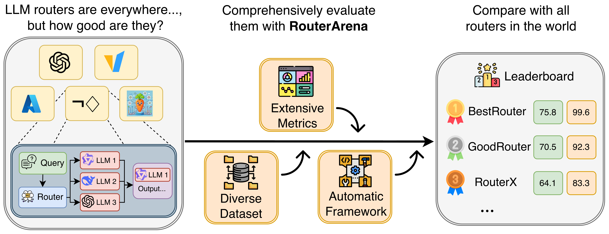
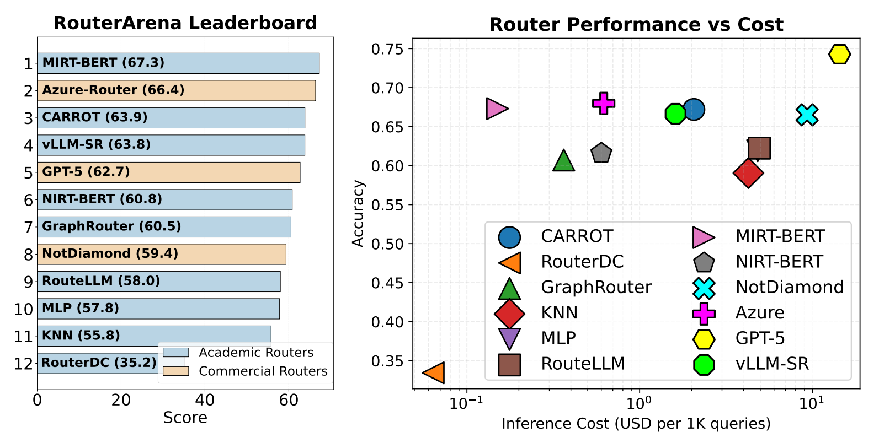

<div align="center">
  

  <br>
  <p>
    <a href="https://huggingface.co/blog/JerryPotter/who-routes-the-routers"></a>
    <a href="https://arxiv.org/abs/2510.00202"></a>
    <a href="https://huggingface.co/datasets/RouteWorks/RouterArena"></a>
    <br>
  </p>

</div>

<h2 align="center"> Make Router Evaluation Open and Standardized </h2>

<p align="center">
  
</p>

**RouterArena** is an open evaluation platform and leaderboard for **LLM routers** — systems that automatically select the best model for a given query. As the LLM ecosystem diversifies into specialized models of varying size, capability, and cost, routing has become essential for balancing performance and efficiency. Yet, unlike models, routers currently lack a unified evaluation standard that measures how well they trade off accuracy, cost, robustness, and latency.

RouterArena addresses this gap by providing a uniform, multi-dimensional benchmarking framework for both open-source and commercial routers. It introduces a principled dataset with diverse domains and difficulty levels, a comprehensive suite of evaluation metrics, and an automated leaderboard for transparent comparison. By standardizing router evaluation, RouterArena lays the foundation for reproducible, fair, and continuous progress in the next generation of routing systems.

<h3 align="left">Key Features</h3>

- **Diverse Data Coverage**: A principled, diverse evaluation dataset spanning 9 domains and 44 categories
- **Comprehensive Eval Metrics**: Five complementary evaluation metrics capturing accuracy, cost, optimality, robustness, and latency.
- **Uniform Eval Framework**: Fairly benchmarked open-sourced and commercial routers.
- **Live Leaderboard**: Ranking routers across multiple dimensions.

<h3 align="left">RouterArena Leaderboard</h3>

| Rank | Router | Affiliation | Arena | Opt.Sel | Opt.Cost | Opt.Acc | Lat | Robust |
|------|---------|--------------|--------|------------|-----------|----------|----------|-------------|
| 🥇 | MIRT-BERT | 🟨 USTC | 66.89 | 3.44 | 19.62 | 78.18 | 27.03 | 94.50 |
| 🥈 | Azure | 🟦&nbsp;Microsoft | 66.66 | 22.52 | 46.32 | 81.96 | — | — |
| 🥉 | NIRT-BERT | 🟨 USTC | 66.12 | 3.83 | 14.04 | 77.88 | 10.42 | 44.50 |
| 4 | GPT-5 | 🟦 OpenAI | 64.32 | — | — | — | — | — |
| 5 | vLLM-SR | 🟦 vLLM | 64.32 | 4.79 | 12.54 | 79.33 | 0.19 | 100.00 |
| 6 | CARROT | 🟨 UMich | 63.87 | 2.68 | 6.77 | 78.63 | 1.50 | 93.60 |
| 7 | NotDiamond | 🟦&nbsp;NotDiamond | 63.00 | 1.55 | 2.14 | 76.81 | — | — |
| 8 | MLP | 🟨 Academic | 57.56 | 13.39 | 24.45 | 83.32 | 90.91 | 96.90 |
| 9 | GraphRouter | 🟨 UIUC | 57.22 | 4.73 | 38.33 | 74.25 | 2.70 | 97.50 |
| 10 | KNN | 🟨 Academic | 55.48 | 13.09 | 25.49 | 78.77 | 1.33 | 51.30 |
| 11 | RouteLLM | 🟨 Berkeley | 48.07 | 99.72 | 99.63 | 68.76 | 0.40 | 99.80 |
| 12 | RouterDC | 🟨 SUSTech | 33.75 | 39.84 | 73.00 | 49.05 | 10.75 | 97.60 |

🟨 Academic  🟦 Commercial 

<!-- <p align="center">
  
</p> -->

The current leaderboard is computed considering the accuracy and overall cost for each router. For more details, please read our [blog](https://huggingface.co/blog/JerryPotter/who-routes-the-routers).

<h2 align="left">Have your router on there!</h3>

If you want your router on the leaderboard, submit a Pull Request with your router's prediction file. For questions or issues, please open a GitHub issue. For fairness, we have withheld the ground truth answers for the full dataset. However, you can still test your router using the sub-sampled 10% dataset by following the steps below.

<p align="center">
  
</p>

## Setup

### Step 1: Install uv and RouterArena

```bash
curl -LsSf https://astral.sh/uv/install.sh | sh
cd RouterArena
uv sync
```

### Step 2: Download Dataset
Run this command to download the dataset from the [HF dataset](https://huggingface.co/datasets/RouteWorks/RouterArena).

```bash
uv run python ./scripts/process_datasets/prep_datasets.py
```

### Step 3: Set Up API Keys

This step is **required only if you plan to use our pipeline to make LLM inferences**. Create a `.env` file in the project root and add the API keys for the providers you need:

```bash
# Example .env file
OPENAI_API_KEY=<Your-Key>
ANTHROPIC_API_KEY=<Your-Key>
HF_TOKEN=<Your-Key>
# ...
```

#### Optional:
See the `ModelInference` class in `RouterArena/llm_inference/model_inference.py` for the complete list of supported providers and required environment variables. You can extend that class to support additional models, or submit a GitHub issue to request support for new providers.

## Usage

Follow the steps below to evaluate your router. You can start with the `sub_10` split (10% sub-sampled dataset) to test your setup and code. The `sub_10` split includes ground truth answers for local testing. Once ready, you can evaluate on the `full` dataset for official leaderboard submission.

### Step 1: Prepare Config File

Create a config file in `./router_inference/config/<router_name>.json`. We have created an example router for demonstration purposes:

```json
{
  "pipeline_params": {
      "router_name": "your-router",
      "models": [
          "gpt-4o-mini",
          "claude-3-haiku-20240307",
          "gemini-2.0-flash-001",
          "mistral-medium"
      ]
  }
}
```

*Note: The model name must be the same as the one used in `./universal_model_names.py` (see next step for details)*

**Important**: For each model in your config, add an entry with the pricing per million tokens in this format at `model_cost/cost.json`:

```json
{
  "gpt-4o-mini": {
    "input_token_price_per_million": 0.15,
    "output_token_price_per_million": 0.6
  },
}
```

### Step 2: Verify Model Names

Ensure all models in your config are listed in `./universal_model_names.py`. If you add a new model, you must also add the API inference endpoint in `RouterArena/llm_inference/model_inference.py`.

### Step 3: Generate Router's Prediction File

Generate a template prediction file:

```bash
uv run python ./router_inference/generate_prediction_file.py your-router sub_10
```

Use `full` instead of `sub_10` for the complete dataset. **Important**: Replace the placeholder model choices in the `prediction` field with your router's actual selections.

### Step 4: Validate Config and Prediction Files

Validate your config and prediction files before proceeding:

```bash
uv run python ./router_inference/check_config_prediction_files.py your-router sub_10
```

This script checks: (1) all model names are valid, (2) prediction file has correct size (809 for `sub_10`, 8400 for `full`), and (3) all entries have valid `global_index`, `prompt`, and `prediction` fields.

## Run LLM Inference

Run the inference script to make API calls for each query using the selected models:

```bash
uv run python ./llm_inference/run.py your-router
```

The script loads your prediction file, makes API calls using the models specified in the `prediction` field, and saves results incrementally. It uses cached results when available and saves progress after each query, so you can safely interrupt and resume. Results are saved to `./cached_results/` for reuse across routers.

**Note**: Requires valid API keys (see Setup Step 3). The script skips entries that already have successful results.

## LLM Evaluation and Compute RouterArena Score

**Important**: For the `sub_10` split (testing), you can run evaluation locally and get RouterArena scores. For the `full` dataset (official leaderboard), ground truth answers are not available locally, but you can submit your router for automatic evaluation via Pull Request.

### Submitting Your Router for Official Evaluation

After running LLM inference on the `full` dataset and ensuring your prediction file has `generated_result` fields populated, submit a Pull Request:

1. **Fork the repository** and create a new branch
2. **Add your files**:
   - `router_inference/config/<router_name>.json` - Your router configuration
   - `router_inference/predictions/<router_name>.json` - Your prediction file with `generated_result` fields populated
3. **Open a Pull Request** - The automated workflow will:
   - Validate your submission
   - Run evaluation on the full dataset
   - Post results as a comment on your PR
   - Update the leaderboard upon approval

**Note**: Make sure to run `llm_inference/run.py` first to populate the `generated_result` fields in your prediction file before submitting.

For questions or issues, please open a GitHub issue.

### Local Evaluation (sub_10 split)

For local evaluation on the `sub_10` split, run the evaluation script:

```bash
uv run python ./llm_evaluation/run.py your-router sub_10
```

The script evaluates generated answers against ground truth, calculates inference costs, and computes router-level metrics including the RouterArena score (ranging 0-1). It skips already-evaluated entries, making it safe to re-run or resume.

## Citation:
If you find our project helpful, please give us a star and cite us by:

```bibtax
@misc{lu2025routerarenaopenplatformcomprehensive,
  title        = {RouterArena: An Open Platform for Comprehensive Comparison of LLM Routers},
  author       = {Yifan Lu and Rixin Liu and Jiayi Yuan and Xingqi Cui and Shenrun Zhang and Hongyi Liu and Jiarong Xing},
  year         = {2025},
  eprint       = {2510.00202},
  archivePrefix= {arXiv},
  primaryClass = {cs.LG},
  url          = {https://arxiv.org/abs/2510.00202}
}
```
